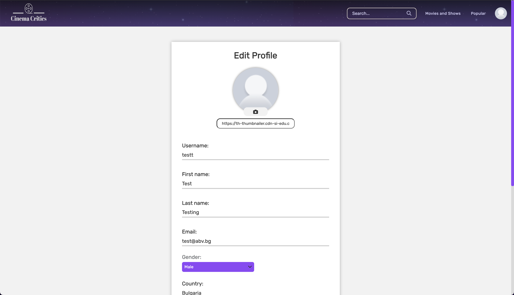
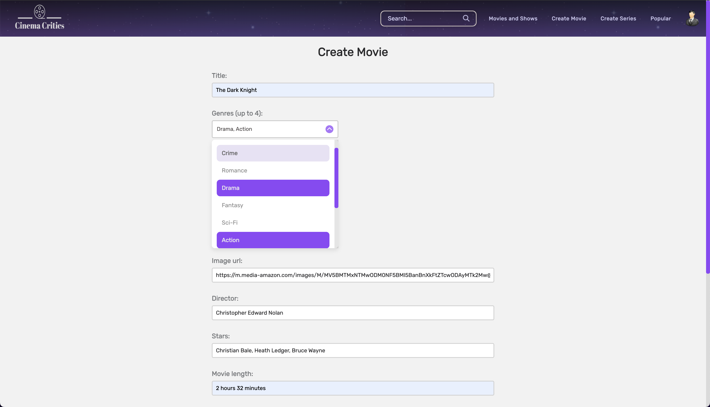
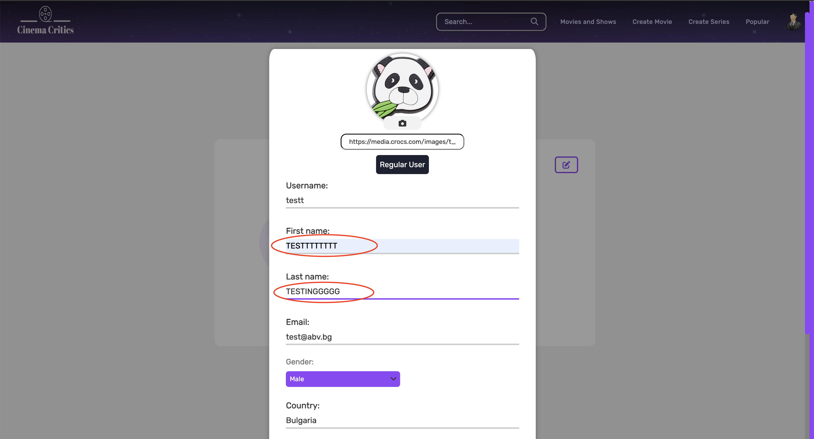

<h1><a href="https://cinema-critics.web.app/">Cinema Critic</a></h1>

<strong>Cinema Critic</strong> is my first personal project. This Single-page application boasts a front-end constructed exclusively with Vanilla JS, HTML, and CSS. Originally, the back-end was based on a service solution from <a href='https://www.back4app.com' target='_blank' rel='noopener noreferrer'>back4app</a>, which utilizes MongoDB as its database. I have since transitioned the back-end to Python/Django with PostgreSQL as the database. You can find the backend repository <a href='https://github.com/eftenow/cinema-critic-server' target='_blank' rel='noopener noreferrer'>here</a>.

<h2>Description</h2>

Cinema Critic offers you detailed information about any movie or series you are interested in. Explore the cast and crew, discover the runtime, read captivating descriptions, and more. Above all, don't forget to create an account and share your thoughts and opinions by leaving reviews for your favorite movies and series. Rate the films, write detailed critiques, and engage in discussions with fellow movie enthusiasts.

Visit Cinema Critic <a href="https://cinema-critics.web.app/">here</a> and be sure to register and leave a review for your favorite movie or series.

<h2>Main Features</h2>

<ul>
<li>

User authentication system with dynamic username/email/password validation during registration and relevant error messages.

&nbsp;&nbsp;&nbsp;   
&nbsp;&nbsp;&nbsp;
</li>

<li>

Fully customizable profile page for a personalized user experience.

&nbsp;&nbsp;&nbsp;
&nbsp;&nbsp;&nbsp;
&nbsp;&nbsp;&nbsp;
&nbsp;&nbsp;&nbsp;
</li>

<li>

Efficient filtration system that allows easy discovery of movies or series based on user preferences.

&nbsp;&nbsp;&nbsp;
&nbsp;&nbsp;&nbsp;
</li>

<li>

Movie details page, including all the information about certain movie/series, its trailer and all the reviews given by users.

&nbsp;&nbsp;&nbsp;
&nbsp;&nbsp;&nbsp;
&nbsp;&nbsp;&nbsp;

After new review was submitted, the movie rating dynamically changed from 7.33 to 8.00

</li>

<li>
    
Search bar with movie/series suggestions that appear as you type more than one letter.

    
</li>

<li>
    
Popular page, ranking the most visited movies/series.

    
</li>

<li>
    
'Add to watchlist' button for bookmarking selected movies/series, adding them to the user's "Watchlist," which can be accessed from the user page.

    
Non-bookmarked movie button looks like this

    
    
After we bookmark it, it looks like this

    
    
Each user can access his watchlist in his profile, it looks like this

    
</li>

<li>
    
'Add review' functionality that enables users to review movies/series, providing a score from 1 to 10 and an optional comment, which we saw earlier. Each user can find their reviews in the "My Reviews" section on the user page, similarly to user's Watchlist.

    
</li>
<li>

Ranking system where each movie/series has its own score, based on the arithmetic mean of all user reviews. The scoring system is dynamic, instantly updating the movie/series rating upon creating, editing, or deleting a review.

&nbsp;&nbsp;&nbsp;

</li>

<li>
    
Pop-up notifications for successful creation, editing, or deletion of a review.

    &nbsp;&nbsp;&nbsp;
    &nbsp;&nbsp;&nbsp;
    
</li>

<li>
    
Custom admin panel/monitoring system for efficient management and Administrator/Moderator roles, with additional permissions.

    
Administrators and Moderators are allowed to Create Movies and Series

    
Now lets hop in the administrator account and check some of the perks to it.

    
    
Movie creation form

    
    
Newly created movie, which was just created. As you can see there are edit/delte buttons beneath it, they are only visible to Moderators and Administrators. 

    
    
Administrators are able to edit another users' data, there are 2 ways to do that, one is by accessing their profile, and the other is by doing it via the admin pannel, which we are going to check later.

    
    
For the sake of the showcase, we are going to edit the first and the last name of a user.

    
    
Here's the same user with updated first name and last name.

    
    
Now lets look at the admin pannel.

    &nbsp;&nbsp;&nbsp;
    
</li>

<li>
    
Fully responsive design for a seamless user experience across all devices.

    &nbsp;&nbsp;&nbsp;
    &nbsp;&nbsp;&nbsp;
    &nbsp;&nbsp;&nbsp;
    &nbsp;&nbsp;&nbsp;
    &nbsp;&nbsp;&nbsp;
    &nbsp;&nbsp;&nbsp;
</li>
</ul>

<h2>Technology Stack</h2>

The main client application is built using Vanilla JS, utilizing limited external libraries for routing, templating, bundling. This approach allowed us to practice and apply core JavaScript concepts effectively.

<ul>
    <li>
        <b>Templating engine</b>
        
I used lit-html as the templating engine due to its lightweight, simplicity, and speed. Having prior experience with the library made it a comfortable choice.

    </li>
    <li>
        <b>Routing</b>
        
For client-side routing in the Single Page Application, I selected a simple and straightforward router that fulfilled the requirement.

    </li>
    <li>
        <b>Bundler</b>
        
Webpack served as the primary bundler, although I utilized it at a basic level, employing "npx webpack" for the job.

    </li>
    <li>
        <b>Deployment</b>
        
To deploy the client, I leveraged Firebase for its user-friendly interface and ease of use.

    </li>
</ul>

